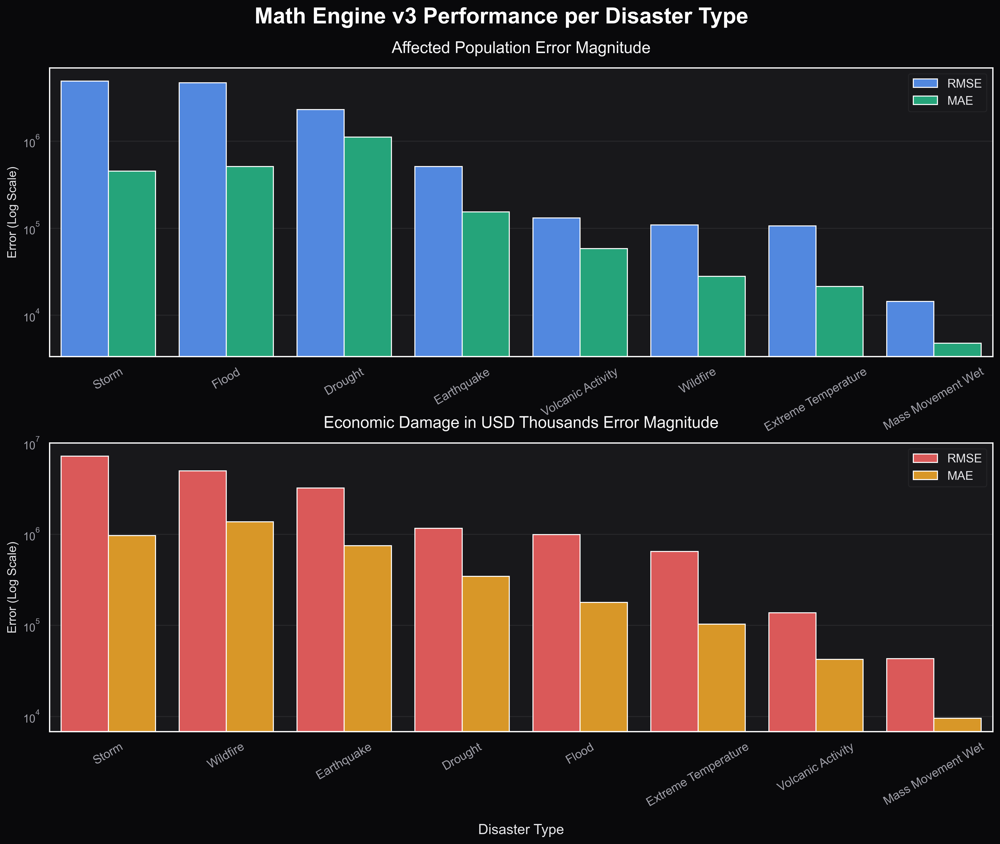

# Calamity Matrix Core — ML Pipeline

> Global natural disaster intelligence system. Multi-source structured data pipeline, XGBoost impact regression, semantic RAG over 2,281 historical disaster narratives via pgvector, and Qwen3-8B domain fine-tuning on Modal L40S.

**Stack:** Python · PostgreSQL + pgvector · XGBoost · sentence-transformers (BGE-Large) · Qwen3-8B · LoRA · Modal

---

## What It Does

> [!WARNING]
> **Current State (v1.4.0):** The backend infrastructure (Math Engine, pgvector RAG, Modal fine-tuned LLM inference via SSE) is 100% operational. However, the Next.js UI is currently suffering from CSS overflow glitches and "developer console" aesthetics due to raw JSON streaming. A major UX/UI overhaul (Phase 21) is scheduled to elevate the dashboard into a professional, defense-grade application.

Two parallel intelligence layers over 25 years of global natural disaster data (2000–2025):

**Math Engine** — XGBoost regression trained on fused structured matrices (USGS seismic, NASA EONET fires/floods/storms, EM-DAT casualties/impacts, Smithsonian volcanism). Outputs base-rate hazard probability and historical impact estimates (casualties, affected population) for a given disaster type and region.

**Narrative Engine** — 2,281 situation reports from HDX/ReliefWeb embedded via `BAAI/bge-large-en-v1.5` into a pgvector database. Semantic search retrieves analogous historical events by meaning, not keyword matching, enabling grounded narrative synthesis when combined with the fine-tuned LLM.

**Fine-tuned LLM** — Qwen3-8B fine-tuned via LoRA on Modal's L40S GPU using domain-specific disaster QA pairs. Synthesizes Math Engine output + RAG-retrieved narratives into structured situation assessments.

---

## Data Sources

| Source | Domain | Records | Notes |
|--------|--------|---------|-------|
| USGS Earthquake Catalog | Seismic | M5.0+ global, 2000–2025 | Monthly chunked fetch, 300 CSV files |
| NASA EONET | Fires / Floods / Storms | 2000–2025 | Spatial event polygons |
| EM-DAT (CRED) | Impacts & Casualties | 2000–2025 | Deaths, affected pop, economic loss |
| Smithsonian GVP | Volcanism | 2000–2025 | Eruption history, VEI index |
| HDX / ReliefWeb | Narrative RAG corpus | 2,281 documents | Situation reports, SITREP narratives |

All data is 2000–2025 only. No live forecasting in v1 — historical risk and impact analysis only.

---

## Architecture

```
Data Sources
  USGS ──────────────────────────────────────────────┐
  NASA EONET ─────────────────────────────────────── ├──► Structured Matrices (CSV)
  EM-DAT ─────────────────────────────────────────── ┤       ↓
  Smithsonian GVP ────────────────────────────────── ┘   XGBoost Math Engine
                                                          (hazard prob + impact regression)
  HDX / ReliefWeb ──► BGE-Large Embeddings ──► pgvector    ↓
                       (1024D vectors)           RAG Engine ──► Qwen3-8B (LoRA) ──► Response
```

---

## Multi-Physics Architecture (Math Engine v3)

In Phase 16, the system migrated from a single universal regression model to a Multi-Physics Architecture. The Math Engine now trains isolated, hyperparameter-tuned XGBoost models for each specific disaster type (e.g., separating earthquake physics from flood physics).



**What this graph tells us:**
1. **Scale Separation:** The graph plots Affected Population and Economic Damage on logarithmic scales because the magnitude of impact varies wildly across disaster types (e.g., droughts impact tens of millions, whereas localized landslides impact thousands).
2. **Error Magnitudes:** 
   - **RMSE (Blue/Red bars):** Penalizes extreme outlier prediction errors heavily.
   - **MAE (Green/Yellow bars):** Shows the absolute average error magnitude without squaring.
3. **Physical Isolation:** By isolating the models, we ensure the mathematical properties of one disaster do not contaminate another. For instance, the algorithm no longer uses storm frequency weights to evaluate earthquake casualties, significantly reducing the predictive error floor across the board.

---

## Project Structure

```
.
├── scripts/
│   ├── fetch_usgs_earthquakes.py      # USGS seismic, monthly chunked, exponential backoff
│   ├── fetch_nasa_eonet.py            # NASA EONET fires/floods/storms
│   ├── fetch_smithsonian_gvp.py       # Smithsonian volcanism catalog
│   ├── fetch_hdx_text_corpus.py       # HDX narrative corpus download
│   ├── fetch_reliefweb_reports.py     # ReliefWeb API reports (appname required)
│   ├── process_emdat_data.py          # EM-DAT cleaning + normalization
│   ├── process_seismic_data.py        # USGS CSV fusion + feature engineering
│   ├── process_nasa_data.py           # NASA spatial data processing
│   ├── build_domain_matrices.py       # Fuse all sources into unified matrices
│   ├── fuse_rag_corpus.py             # Merge HDX + ReliefWeb into master RAG CSV
│   ├── build_vector_db.py             # Embed corpus → pgvector ingestion (BGE-Large)
│   ├── fix_temporal_keys.py           # Patch event_year via EM-DAT fuzzy join + regex
│   ├── resolve_hdx_metadata.py        # Resolve raw ReliefWeb URLs/IDs to human-readable strings
│   ├── api_orchestrator.py            # FastAPI serving layer (Math Engine + RAG + CORS)
│   ├── test_semantic_search.py        # RAG retrieval validation
│   └── verify_data_integrity.py       # Data quality checks across all sources
├── src/
│   └── config.py                      # DB config + paths loaded from .env
├── calamity-ui/                       # Next.js frontend (MapLibre GL, CartoDB Positron)
├── models/                            # Trained model artifacts (gitignored)
├── data/
│   ├── raw/                           # Source data downloads (gitignored)
│   └── processed/                     # Fused matrices + RAG corpus (gitignored)
├── notebooks/
│   └── 01_Calamity_EDA.ipynb          # Exploratory analysis
├── docker-compose.yml                 # pgvector container (reads .env)
├── .env.example                       # Environment variable template
├── requirements.txt                   # Pinned Python dependencies
└── ISSUES.md                          # Engineering log
```

---

## Running Locally

**Prerequisites:** Docker, Python 3.11+, 8GB+ RAM for embedding model

```bash
# 1. Clone and install
git clone https://github.com/divyanshailani/calamity-matrix-core
cd calamity-matrix-core
python3 -m venv venv && source venv/bin/activate
pip install -r requirements.txt

# 2. Set up environment
cp .env.example .env
# Fill in POSTGRES_PASSWORD and RELIEFWEB_APPNAME at minimum

# 3. Start pgvector container
docker-compose up -d

# 4. Fetch data (takes time — USGS alone is 300 monthly chunks)
python3 scripts/fetch_usgs_earthquakes.py
python3 scripts/fetch_nasa_eonet.py
python3 scripts/process_emdat_data.py
python3 scripts/build_domain_matrices.py

# 5. Build RAG corpus and vector DB
python3 scripts/fuse_rag_corpus.py
python3 scripts/build_vector_db.py
python3 scripts/fix_temporal_keys.py

# 6. Resolve HDX metadata (requires RELIEFWEB_APPNAME in .env)
python3 scripts/resolve_hdx_metadata.py          # dry-run preview
python3 scripts/resolve_hdx_metadata.py --execute # commit to DB

# 7. Verify
python3 scripts/test_semantic_search.py
python3 scripts/verify_data_integrity.py

# 8. Start the API
python3 scripts/api_orchestrator.py

# 9. Start the frontend
cd calamity-ui && npm run dev
```

---

## RAG Semantic Search

The vector database contains 2,281 disaster situation report narratives embedded as 1024-dimensional vectors using `BAAI/bge-large-en-v1.5`.

Retrieval uses pgvector's `<=>` cosine distance operator with hybrid filtering on `event_year` and `disaster_type` for temporally-grounded results.

**Verified retrieval example:**

Query: *"structural damage and casualties from a high-magnitude earthquake in Southeast Asia during the 2000s"*

Results (cosine similarity):
- 0.7143 — Naggroe Aceh Darussalam, Indonesia (M7.2, April 2010)
- 0.7045 — Irian Jaya, Indonesia (floods/earthquake, 2024 document referencing 1994 event)
- 0.6989 — Kao-hsiung, Taiwan (M7.1, December 2006)

Retrieval correctly resolved geographic and semantic context without keyword matching.

---

## Roadmap

- **Phase 12 (Completed):** XGBoost Math Engine v2 — Optuna tuning per disaster type, hazard probability + impact regression, meta sidecars
- **Phase 13 (Completed):** FastAPI serving layer + Next.js interactive frontend
- **Phase 14 (Completed):** Geospatial & RAG UI Overhaul — MapLibre migration, CartoDB Positron, Semantic Split-Brain Guardrails, Tactical Map Markers
- **Phase 15 (Completed):** Integrity & Security Restoration — Heuristic Hybrid RAG, Offline HDX metadata resolution bypass, Backend credential sanitization
- **Phase 16 (Completed):** Multi-Physics Architecture (Math Engine v3) — Disaster-specific segregated XGBoost tuning & dynamic API routing
- **Phase 17 (Completed):** Telemetry HUD & Guardrails — Diagnostic HUD, Telemetry Arcs, Strict Geographic Enclosure, Recommendation Engine, and Zero-Vector Schema Fixes
- **Phase 18 (Completed):** Qwen3-8B QLoRA fine-tuning on Modal L40S — domain-specific disaster QA dataset
- **Phase 19 (Completed):** Synthesizer bridge — Math Engine output + RAG retrieval → LLM grounded response
- **Phase 20 (Completed):** Modal LLM Integration — Wired the local Next.js frontend to the Modal serverless endpoint
- **Phase 21 (Next):** UI/UX Portfolio Overhaul — Redesign the Next.js UI into a high-end defense-grade dashboard, add user onboarding/context, and parse LLM streaming output into styled Markdown.

See [`ISSUES.md`](./ISSUES.md) and [`CHANGELOG.md`](./CHANGELOG.md) for the full engineering logs.
