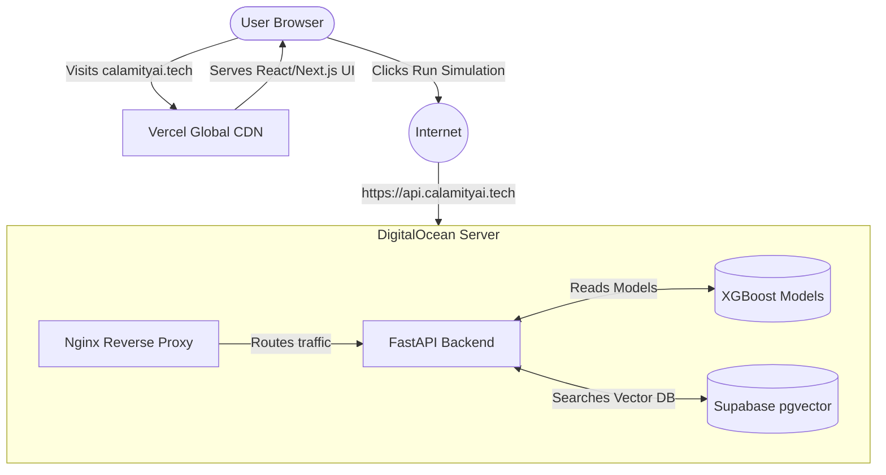

# Calamity Matrix — Production Deployment Guide

## Architecture



We split the application into two completely separate pieces. This is called **Decoupling**.
1. **The Frontend**: Hosted on Vercel. Vercel takes the Next.js React code, builds it into static files, and serves it to users instantly via their global CDN.
2. **The Backend**: Hosted on a DigitalOcean Droplet. This dedicated server does all the heavy math (XGBoost) and AI processing securely behind an Nginx Reverse Proxy.

## Stack

| Layer | Technology |
|---|---|
| **Frontend Server** | Vercel Global Edge Network |
| **Backend Server** | DigitalOcean Droplet (Ubuntu 24.04) |
| **Backend Container** | Docker + Docker Compose |
| **Reverse Proxy** | Nginx (alpine) |
| **SSL** | Let's Encrypt via Certbot |
| **Firewall** | UFW (ports 22, 80, 443 only) |
| **API** | FastAPI + Uvicorn |
| **Database** | Supabase pgvector (external) |
| **Domains** | `calamityai.tech` (Frontend), `api.calamityai.tech` (Backend) |

---

## First-Time Backend Deployment

### Step 1 — Create DigitalOcean Droplet
- OS: Ubuntu 24.04 LTS
- Region: Bangalore (BLR1)
- Add your SSH key during creation

### Step 2 — SSH into the Droplet
```bash
ssh root@YOUR_DROPLET_IP
```

### Step 3 — Run the Setup Script
```bash
curl -fsSL https://raw.githubusercontent.com/divyanshailani/calamity-matrix-core/main/deploy/scripts/setup.sh | bash
```

### Step 4 — Configure Environment Variables
```bash
nano /opt/calamity/calamity-matrix-core/.env
```

Fill in all values (see `.env.example`):
```env
DATABASE_URL=postgresql://...  # Supabase Transaction Pooler URL
HF_TOKEN=hf_...
POSTGRES_PASSWORD=...
```

### Step 5 — Point DNS to Droplet
Go to your .TECH domain registrar and add:
```
A    api.calamityai.tech  →  YOUR_DROPLET_IP
```
Wait ~5 minutes for DNS propagation.

### Step 6 — Issue SSL Certificate
```bash
# This will stop the host nginx, generate the cert, and restart it.
bash /opt/calamity/calamity-matrix-core/deploy/scripts/ssl.sh
```

### Step 7 — Deploy
```bash
bash /opt/calamity/calamity-matrix-core/deploy/scripts/deploy.sh
```

---

## Updating the Deployment

Every time you push new backend code to GitHub, deploy with one command:
```bash
ssh root@YOUR_DROPLET_IP "cd /opt/calamity/calamity-matrix-core && git pull && docker compose -f deploy/docker-compose.prod.yml up -d --build"
```

*(Note: Frontend changes to the `calamity-ui` folder are automatically deployed by Vercel on every GitHub push).*

---

## Useful Commands

```bash
# View running containers
docker ps

# View API logs (live)
docker logs calamity_api -f

# View Nginx logs
docker logs calamity_nginx -f

# Force recreate container if ports aren't binding
docker compose -f /opt/calamity/calamity-matrix-core/deploy/docker-compose.prod.yml up -d --force-recreate nginx

# Stop everything
docker compose -f /opt/calamity/calamity-matrix-core/deploy/docker-compose.prod.yml down

# Check server resources
htop

# Check disk usage
df -h

# Check firewall status
ufw status verbose
```

---

## Health Check

```bash
curl https://api.calamityai.tech/health
# Expected: {"status": "ok", ...}
```
